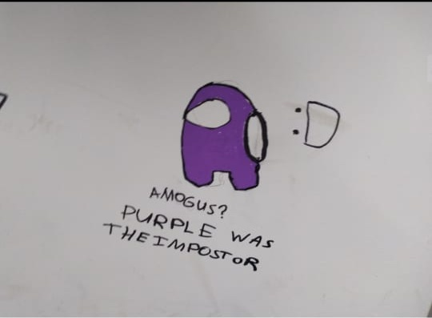

# Crop AI

Crop your images with AI

Before Crop            |  After Crop
:-------------------------:|:-------------------------:
  |  

### Dependencies :
* [Python](https://www.python.org)
* [OpenCV](https://opencv.org)
* [Numpy](https://numpy.org)

### Usage :
``` console
user@main:~$ python cropai.py <image_path> <image_destination>
```